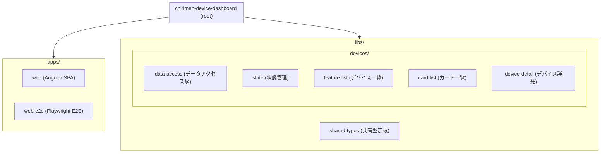
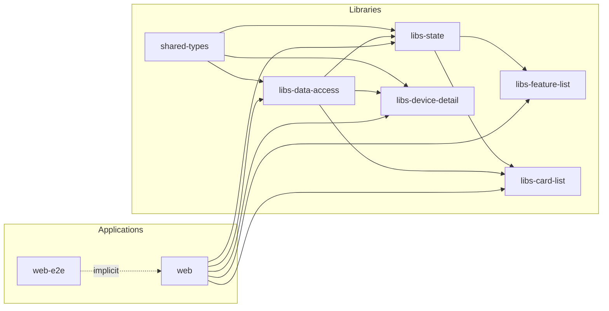
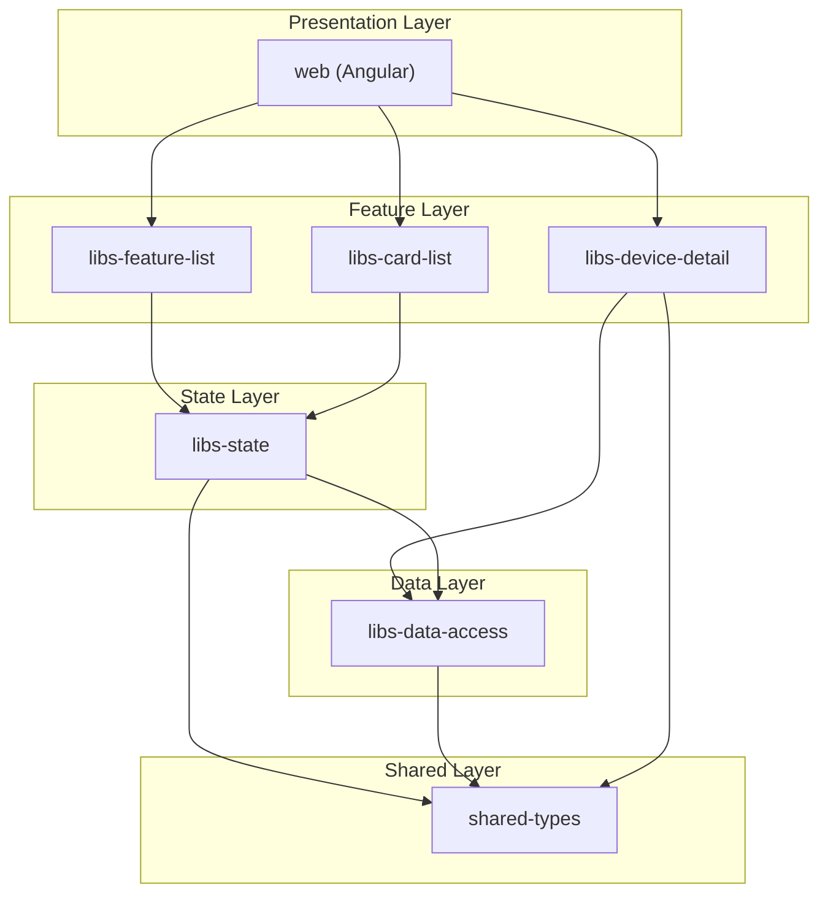

# chirimen-device-dashboard

CHIRIMEN デバイス一覧のダッシュボード。Nx モノレポで構成されています。

## chirimen-device-dashboard Nx ワークスペース構造

### ディレクトリ構造



### プロジェクト依存関係グラフ



### レイヤー別アーキテクチャ



### プロジェクト一覧

| プロジェクト | パス | 種別 | 説明 |
| --- | --- | --- | --- |
| web | apps/web | Application | Angular フロントエンド (ポート 4200) |
| web-e2e | apps/web-e2e | E2E | Playwright による Web E2E テスト |
| shared-types | libs/shared-types | Library | DeviceInfo, ProductInfo 等の共有型 |
| libs-data-access | libs/devices/data-access | Library | デバイスリポジトリ・データアクセス |
| libs-state | libs/devices/state | Library | DeviceListStore 等の状態管理 |
| libs-feature-list | libs/devices/feature-list | Library | デバイス一覧 UI コンポーネント |
| libs-card-list | libs/devices/card-list | Library | デバイスカード一覧 UI |
| libs-device-detail | libs/devices/device-detail | Library | デバイス詳細 UI |

## Quick Start

```bash
pnpm install
pnpm nx graph
pnpm nx build
```

## Running Tests

```bash
pnpm test          # web のユニットテスト
pnpm test:all      # 全プロジェクトのテスト
```

**IDE (Cursor / VSCode) でテストを実行する場合:**

- このプロジェクトは **Vitest** を使用しています（Jest は使用していません）
- Vitest 拡張機能をインストールし、Jest 拡張機能は無効化またはアンインストールしてください
- ターミナルで `pnpm test` を実行するか、タスク「Run Tests (web)」を使用してください

## Learn More

- [Nx Documentation](https://nx.dev/getting-started/intro)
- [Nx Cloud](https://nx.app)
