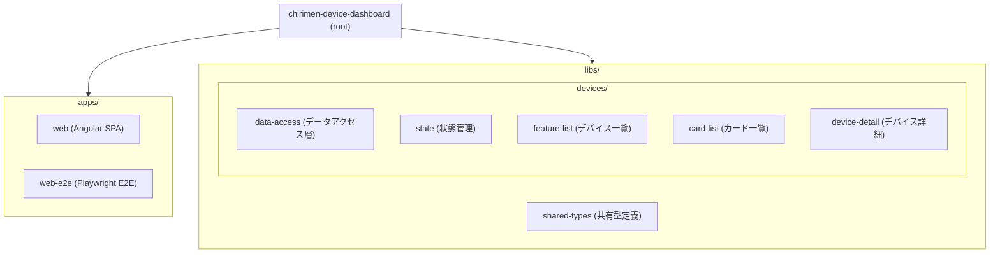
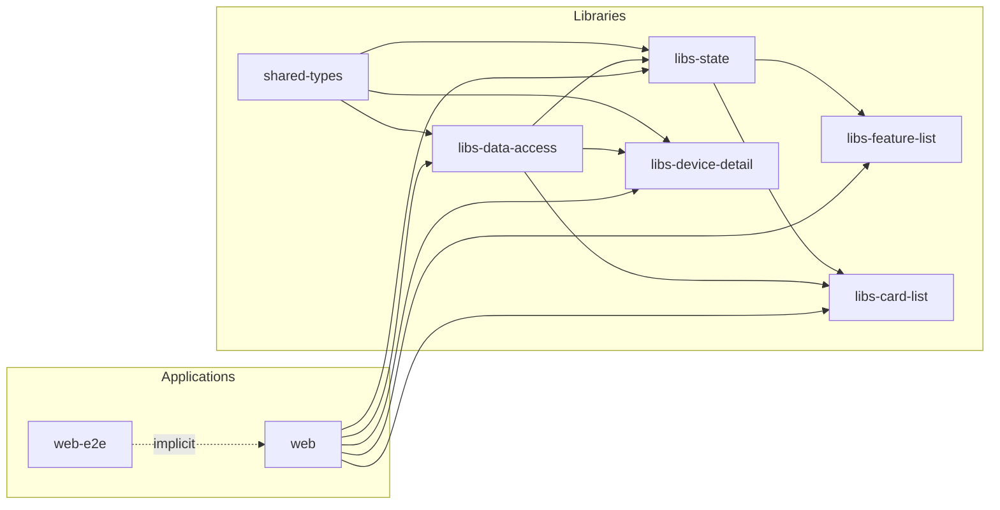
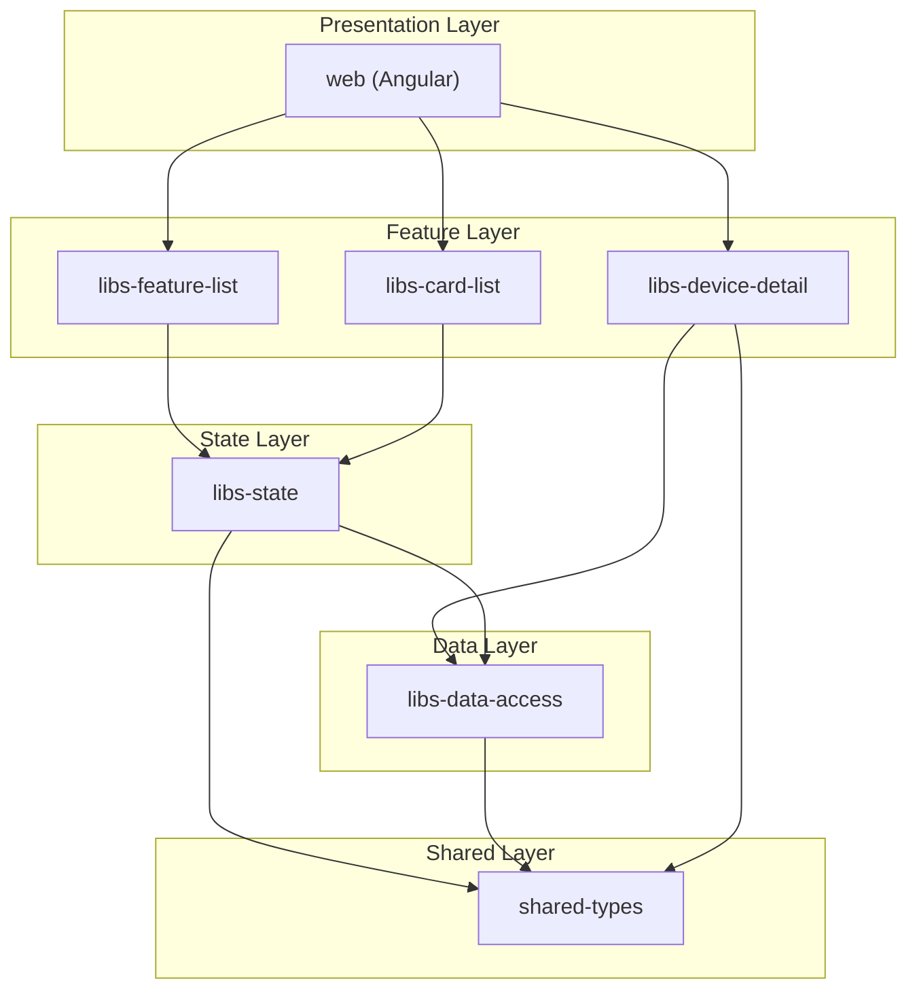

# chirimen-device-dashboard

CHIRIMEN デバイス一覧のダッシュボード。Nx モノレポで構成されています。

## chirimen-device-dashboard Nx ワークスペース構造

### ディレクトリ構造



### プロジェクト依存関係グラフ



### レイヤー別アーキテクチャ



### プロジェクト一覧

| プロジェクト | パス | 種別 | 説明 |
| --- | --- | --- | --- |
| web | apps/web | Application | Angular フロントエンド (ポート 4200) |
| web-e2e | apps/web-e2e | E2E | Playwright による Web E2E テスト |
| shared-types | libs/shared-types | Library | DeviceInfo, ProductInfo 等の共有型 |
| libs-data-access | libs/devices/data-access | Library | デバイスリポジトリ・データアクセス |
| libs-state | libs/devices/state | Library | DeviceListStore 等の状態管理 |
| libs-feature-list | libs/devices/feature-list | Library | デバイス一覧 UI コンポーネント |
| libs-card-list | libs/devices/card-list | Library | デバイスカード一覧 UI |
| libs-device-detail | libs/devices/device-detail | Library | デバイス詳細 UI |

## Quick Start

```bash
pnpm install
pnpm nx graph
pnpm nx build
```

## Running Tests

```bash
pnpm test          # web のユニットテスト
pnpm test:all      # 全プロジェクトのテスト
```

**IDE (Cursor / VSCode) でテストを実行する場合:**

- このプロジェクトは **Vitest** を使用しています（Jest は使用していません）
- Vitest 拡張機能をインストールし、Jest 拡張機能は無効化またはアンインストールしてください
- ターミナルで `pnpm test` を実行するか、タスク「Run Tests (web)」を使用してください

## AI エージェント向け設定（Cursor Skills / Rules）

本プロジェクトは Cursor などの AI コーディングエージェントが Angular / Nx Workspace の構造とベストプラクティスを理解できるよう、Skills と Cursor Rules を導入しています（Issue #165）。

### Angular Skills

Angular 公式 Skills を `.agents/skills/` 配下に導入しています。

- `angular-developer` — Angular の一般的な開発知識（Standalone Components / Signals / DI / ルーティング / フォーム / テスト など）
- `angular-new-app` — Angular 新規アプリ作成のガイダンス

再導入する場合は以下を実行してください。

```bash
npx skills add https://github.com/angular/skills
```

### Nx AI Agent 設定

Nx AI Agents により、Nx Workspace 構造を AI に理解させるための Skills (`nx-workspace` / `nx-generate` / `nx-run-tasks` ほか)、Nx Console (MCP) 連携、ルート `AGENTS.md`、`.cursor/agents/` 配下のサブエージェント定義を導入しています。

再設定する場合は以下を実行してください。

```bash
pnpm nx configure-ai-agents --agents cursor --no-interactive
```

### Cursor Rules (`.mdc`)

`.cursor/rules/` 配下に責務別の Rules を配置しています。

```text
.cursor/rules/
├── angular/
│   ├── 00-angular-core.mdc       # Angular ベースライン
│   ├── 10-angular-signals.mdc    # Signals の使い分け
│   ├── 20-angular-components.mdc # Component 設計
│   └── 30-angular-testing.mdc    # テスト方針
├── nx/
│   ├── 00-nx-workspace.mdc       # Workspace 全体ルール
│   ├── 10-nx-generators.mdc      # Nx Generator 利用方針
│   └── 20-nx-tasks.mdc           # Nx タスク実行方針
├── commits/
│   ├── 40-conventional-commits.mdc            # Conventional Commits 基本ルール
│   ├── 41-pull-request-title.mdc              # PR タイトル規約
│   └── 42-chirimen-device-dashboard-scope.mdc # 固有 scope 一覧
└── workflow/
    └── 90-ai-workflow.mdc        # AI 編集時の共通ルール
```

各 `.mdc` は `globs` で対象ファイルを限定しているため、対象ファイルを Cursor で開くと自動でルールが参照されます。

### 役割分離

| 種類                       | 役割                                              | 配置                                     |
| -------------------------- | ------------------------------------------------- | ---------------------------------------- |
| Angular Skills             | Angular の一般知識                                | `.agents/skills/`                        |
| Nx AI Agent                | Nx Workspace 理解                                 | `.agents/skills/` ほか                   |
| Cursor Rules               | Workspace の設計ルール (責務別)                   | `.cursor/rules/`                         |
| Conventional Commits Rules | commit message / PR title の規約 (Issue #167)     | `.cursor/rules/commits/`                 |
| Conventional Commits Skill | AI 向け Conventional Commits 知識 (Issue #167)    | `.cursor/skills/conventional-commits/`   |
| AI Workflow                | AI 編集時の共通ルール                             | `.cursor/rules/workflow/`                |

### Conventional Commits

commit message と PR タイトルは [Conventional Commits](https://www.conventionalcommits.org/) に統一しています。詳細は [CONTRIBUTING.md](CONTRIBUTING.md) と [.cursor/skills/conventional-commits/SKILL.md](.cursor/skills/conventional-commits/SKILL.md) を参照してください。

### 将来的な拡張候補

以下は今回の対象外（Issue #165 のスコープに記載）。将来別 Issue / PR で導入を検討します。

- NgRx 用 mdc
- Storybook 用 mdc
- CI/CD 用 mdc
- ADR / Architecture 用 mdc

## Learn More

- [Nx Documentation](https://nx.dev/getting-started/intro)
- [Nx Cloud](https://nx.app)
