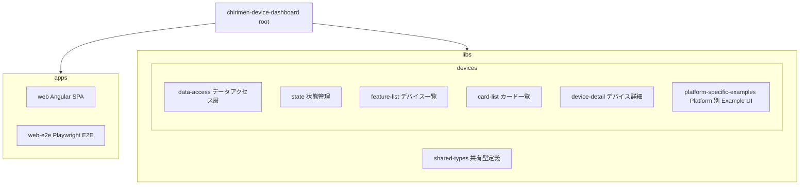
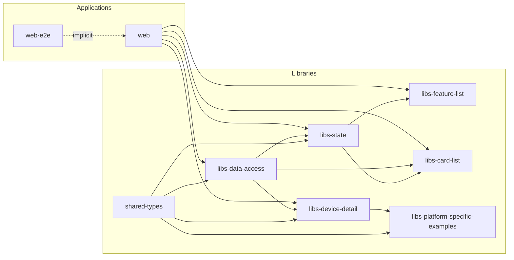
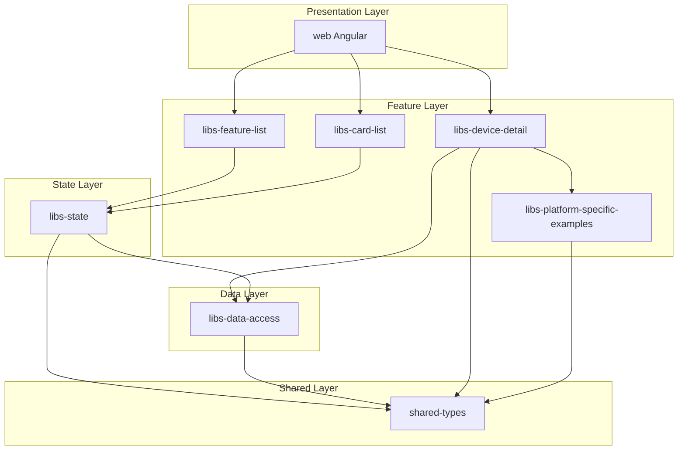
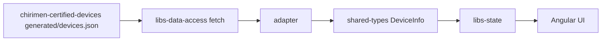

# アーキテクチャ

CHIRIMEN デバイスダッシュボードは Nx モノレポで構成されています。Angular SPA の `web` を入口に、Certified Devices JSON の取得、Dashboard Model への変換、状態管理、一覧・詳細 UI をプロジェクト単位で分離しています。デバイスデータの生成はこのリポジトリの責務ではありません。

## ディレクトリ構造

## プロジェクト依存関係グラフ

## レイヤー別アーキテクチャ

## データフロー

Dashboard は実行時に `chirimen-certified-devices/generated/devices.json` を取得し、adapter で Dashboard Model に変換してから UI へ渡します。

## プロジェクト一覧

| プロジェクト | パス | 種別 | 説明 |
| --- | --- | --- | --- |
| `chirimen-device-dashboard` | `.` | Workspace | ルート workspace project |
| `web` | `apps/web` | Application | Angular フロントエンド |
| `web-e2e` | `apps/web-e2e` | Application | Playwright による E2E テスト |
| `shared-types` | `libs/shared-types` | Library | `DeviceInfo` / `ProductInfo` 等の共有型 |
| `libs-data-access` | `libs/devices/data-access` | Library | Certified Devices JSON の取得と adapter |
| `libs-state` | `libs/devices/state` | Library | `DeviceListStore` 等の状態管理 |
| `libs-feature-list` | `libs/devices/feature-list` | Library | デバイス一覧 UI コンポーネント |
| `libs-card-list` | `libs/devices/card-list` | Library | デバイスカード一覧 UI |
| `libs-device-detail` | `libs/devices/device-detail` | Library | デバイス詳細 UI |
| `libs-platform-specific-examples` | `libs/devices/platform-specific-examples` | Library | Platform 別 Example UI |

## 主なデータ境界

- 外部 JSON (`chirimen-certified-devices/generated/devices.json`) の入力型は `libs-data-access` 内部のみが扱う。UI / state は参照しない。
- adapter は外部 JSON を `DeviceInfo` などの Dashboard Model に変換する。
- `shared-types` の Dashboard Model は state と UI が共有する表示用の型である。
- デバイスデータの正本と生成は [`chirimen-certified-devices`](https://github.com/gurezo/chirimen-certified-devices) の責務である。
