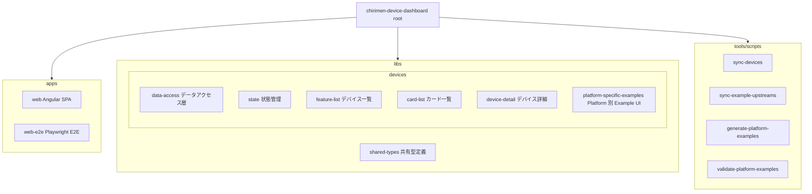
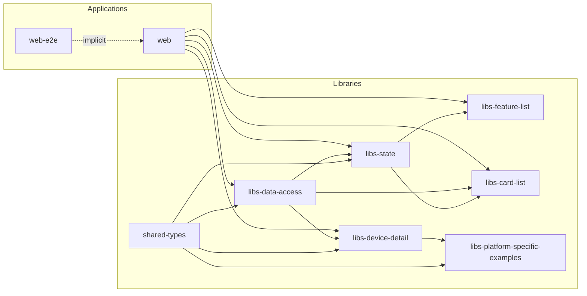
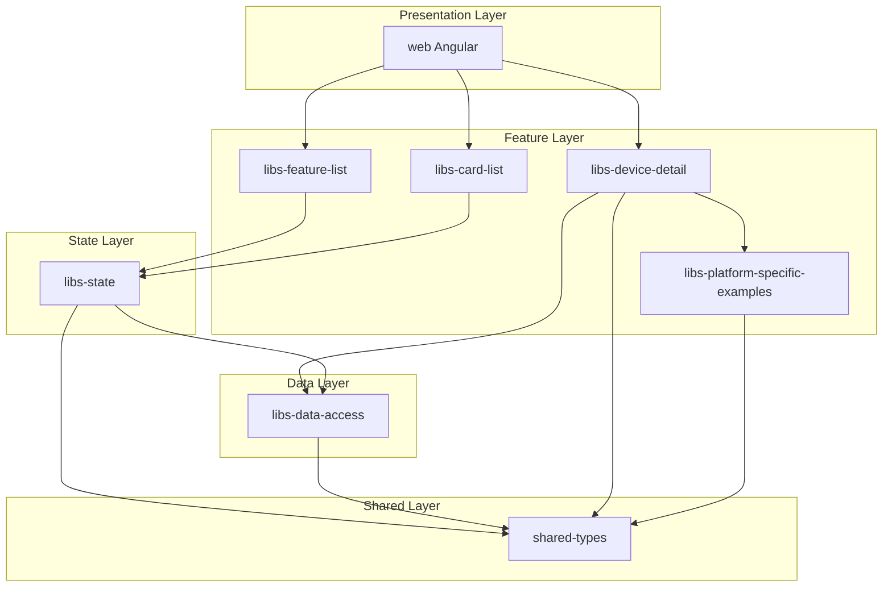

# アーキテクチャ

CHIRIMEN デバイスダッシュボードは Nx モノレポで構成されています。Angular SPA の `web` を入口に、デバイス情報の取得、状態管理、一覧・詳細 UI、データ生成ツールをプロジェクト単位で分離しています。

## ディレクトリ構造

## プロジェクト依存関係グラフ

## レイヤー別アーキテクチャ

## プロジェクト一覧

| プロジェクト | パス | 種別 | 説明 |
| --- | --- | --- | --- |
| `chirimen-device-dashboard` | `.` | Workspace | ルート workspace project |
| `web` | `apps/web` | Application | Angular フロントエンド |
| `web-e2e` | `apps/web-e2e` | Application | Playwright による E2E テスト |
| `shared-types` | `libs/shared-types` | Library | `DeviceInfo` / `ProductInfo` 等の共有型 |
| `libs-data-access` | `libs/devices/data-access` | Library | デバイスリポジトリ・データアクセス |
| `libs-state` | `libs/devices/state` | Library | `DeviceListStore` 等の状態管理 |
| `libs-feature-list` | `libs/devices/feature-list` | Library | デバイス一覧 UI コンポーネント |
| `libs-card-list` | `libs/devices/card-list` | Library | デバイスカード一覧 UI |
| `libs-device-detail` | `libs/devices/device-detail` | Library | デバイス詳細 UI |
| `libs-platform-specific-examples` | `libs/devices/platform-specific-examples` | Library | Platform 別 Example UI |
| `sync-devices` | `tools/scripts/sync-devices` | Application | `partslist.csv` と正本データから `devices.json` を生成 |
| `sync-example-upstreams` | `tools/scripts/sync-example-upstreams` | Application | upstream example repository を同期し、候補とレポートを生成 |
| `generate-platform-examples` | `tools/scripts/generate-platform-examples` | Application | upstream 同期結果から Platform 別 Example 候補 JSON を生成 |
| `validate-platform-examples` | `tools/scripts/validate-platform-examples` | Application | Platform 別 Example と `devices.json` の整合性を検証 |

## 主なデータ境界

- `apps/web/public/devices.json` はフロントエンドが読み込む公開データです。
- `data/platform-examples/platform-examples.json` は Platform 別 Example の正本データです。
- `generated/reports/**` は同期・生成・検証で出力されるレビュー用レポートです。
- `generated/upstreams/**` は upstream repository の mirror で、リポジトリにはコミットしません。
