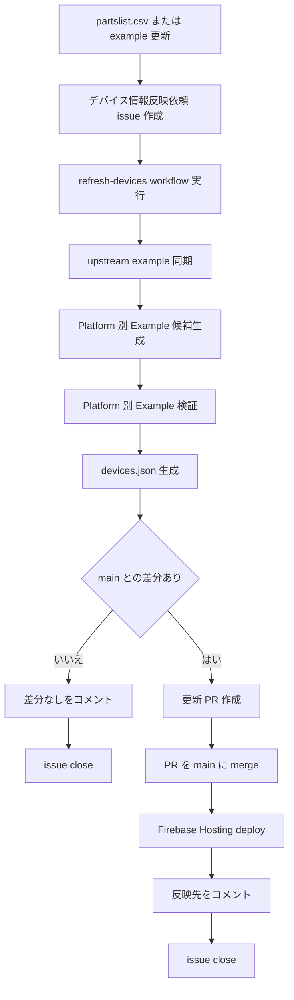
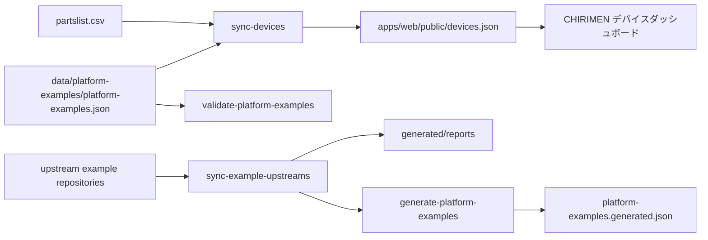

# デバイス情報の更新フロー

CHIRIMEN デバイスダッシュボードの表示内容は、公開データ `apps/web/public/devices.json` をもとにしています。このファイルは `partslist.csv` と Platform 別 Example の正本データから生成され、Firebase Hosting へデプロイされます。

## コミュニティメンバー向けの依頼手順

`partslist.csv` や各 example repository の変更をダッシュボードへ反映したい場合は、次の手順で依頼します。

1. `partslist.csv` または各 example repository に変更を commit / merge する
2. CHIRIMEN デバイスダッシュボードで `🔄 デバイス情報反映依頼` テンプレートを使って issue を作成する
3. CI / workflow の終了を待つ
4. issue に実行結果がコメントされる
5. 差分がない場合は issue が閉じる
6. 差分がある場合は更新 PR が作成される
7. 更新 PR が `main` に merge される
8. Firebase Hosting への deploy が成功すると、issue に反映先がコメントされて閉じる
9. CHIRIMEN デバイスダッシュボードに反映される

反映後の確認では、ハードリロードまたは別ブラウザでダッシュボードにアクセスしてください。

## 更新フロー



## 関連する GitHub Actions

| Workflow | ファイル | 役割 |
| --- | --- | --- |
| Refresh devices data | [`.github/workflows/refresh-devices.yml`](../.github/workflows/refresh-devices.yml) | `refresh-devices` ラベル付き issue または手動実行から、同期・生成・検証・PR 作成を行う |
| Deploy to Firebase Hosting | [`.github/workflows/deploy.yml`](../.github/workflows/deploy.yml) | `main` への push 後に build / deploy し、対象の反映依頼 issue を close する |
| Generate devices.json | [`.github/workflows/generate-devices.yml`](../.github/workflows/generate-devices.yml) | PR / `main` で `devices.json` の生成ドリフトを検出する |
| Generate platform examples | [`.github/workflows/generate-platform-examples.yml`](../.github/workflows/generate-platform-examples.yml) | Platform 別 Example 候補 JSON の生成ドリフトを検出する |
| Validate platform examples | [`.github/workflows/validate-platform-examples.yml`](../.github/workflows/validate-platform-examples.yml) | 正本データと `devices.json` の整合性を検証する |

## `refresh-devices` issue で実行される処理

`🔄 デバイス情報反映依頼` テンプレートで issue を作成すると、`refresh-devices` ラベルが付きます。このラベルをきっかけに `.github/workflows/refresh-devices.yml` が起動します。

workflow は次の順にコマンドを実行します。

```bash
pnpm sync:example-upstreams
pnpm generate:platform-examples
pnpm validate:platform-examples
pnpm generate:devices
```

差分がある場合、workflow は次のファイルを含む更新 PR を作成します。

- `apps/web/public/devices.json`
- `data/platform-examples/**`
- `generated/reports/**`

差分がない場合、PR は作成されず、issue に「差分なし」がコメントされて close されます。

## データ生成の入力と出力



`platform-examples.generated.json` は review 用の候補 JSON です。正本 `data/platform-examples/platform-examples.json` は自動では上書きされないため、必要な差分はレビュー後に手動で反映します。

## 反映確認とキャッシュ

ダッシュボードは起動時に `/devices.json` を取得して表示します。アプリ内では取得結果が再利用されるため、同じブラウザタブを開いたままだと最新の `devices.json` を再取得しない場合があります。

デプロイ後に反映を確認する場合は、次のどちらかを試してください。

- ハードリロードする
- 別ブラウザまたはシークレットウィンドウでアクセスする

`/devices.json` は `cache-control: max-age=3600` で配信されます。そのため、ブラウザや CDN が最大 1 時間古い内容を使う可能性があります。すぐに更新内容が見えない場合は、時間を置いてから再確認してください。

## 関連ドキュメント

- [Platform 別 Example 元データ](../data/platform-examples/README.md)
- [sync-devices](../tools/scripts/sync-devices/README.md)
- [sync-example-upstreams](../tools/scripts/sync-example-upstreams/README.md)
- [generate-platform-examples](../tools/scripts/generate-platform-examples/README.md)
- [validate-platform-examples](../tools/scripts/validate-platform-examples/README.md)
