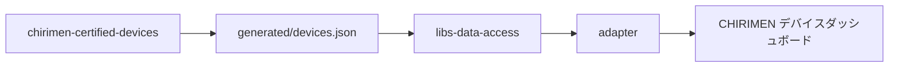

# デバイス情報の更新

CHIRIMEN デバイスダッシュボードの表示内容は、実行時に取得する [`chirimen-certified-devices/generated/devices.json`](https://github.com/gurezo/chirimen-certified-devices/blob/main/generated/devices.json) をもとにしています。デバイスデータの正本と生成は [`chirimen-certified-devices`](https://github.com/gurezo/chirimen-certified-devices) の責務です。Dashboard 側では同期・生成しません。

## コミュニティメンバー向けの手順

デバイス情報の追加・修正は次の手順で行います。

1. [`chirimen-certified-devices`](https://github.com/gurezo/chirimen-certified-devices) でデバイスデータを追加・修正する
2. そのリポジトリの手順に従って `generated/devices.json` を更新する
3. `main` に反映された JSON を Dashboard が実行時に取得する

Dashboard リポジトリに反映依頼 issue を立てる必要はありません。

## 報告先の区別

| 内容 | 報告先 |
| --- | --- |
| デバイス名・製品リンク・Example などデータの追加・修正・不備 | [`chirimen-certified-devices`](https://github.com/gurezo/chirimen-certified-devices) |
| 一覧・検索・詳細など Dashboard UI の不具合・機能改善 | 本リポジトリの [バグ報告](https://github.com/gurezo/chirimen-device-dashboard/issues/new?template=bug_report.ja.yml) / [機能要望](https://github.com/gurezo/chirimen-device-dashboard/issues/new?template=feature_request.ja.yml) |

本リポジトリの Issue 作成画面は Dashboard 固有の不具合・機能改善のみを対象とします。デバイス情報の追加・修正は [`chirimen-certified-devices`](https://github.com/gurezo/chirimen-certified-devices) で行ってください。

## データフロー

## 反映確認

ダッシュボードは起動時に Certified Devices JSON を取得して表示します。アプリ内では取得結果が再利用されるため、同じブラウザタブを開いたままだと最新データを再取得しない場合があります。

GitHub raw 経由の取得のため、ブラウザや CDN が古い内容を使う可能性もあります。反映を確認する場合は、次のいずれかを試してください。

- ハードリロードする
- 別ブラウザまたはシークレットウィンドウでアクセスする
- 時間を置いてから再確認する

## 関連ドキュメント

- [アーキテクチャ](architecture.md)
- [chirimen-certified-devices](https://github.com/gurezo/chirimen-certified-devices)
